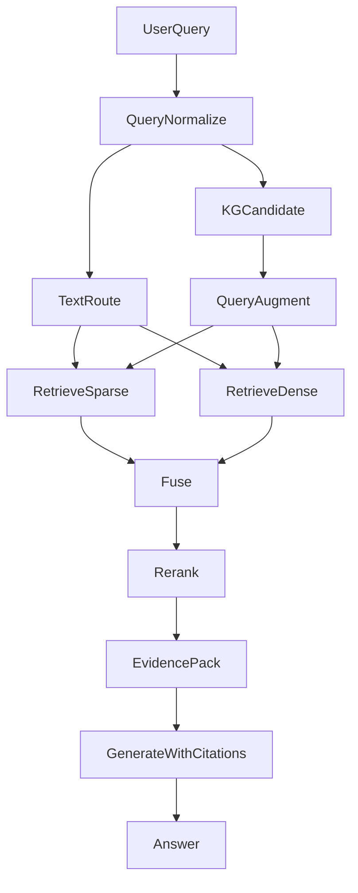

# 纯文本RAG-SOTA总结

> source: obsidian://02.科研/RAG/纯文本RAG-SOTA总结.md
> vault: /Users/mizi/Documents/Obsidian Vault

---
date: 2026-04-15
tags: ["research/RAG"]
---
我可以把**“纯文本RAG”学术界最前沿的架构谱系**（检索范式、重排/融合、生成控制、评测与安全）系统梳理出来，并逐一对你这个**诊断系统**给出落地适配建议。为避免我按错约束，先确认两点关键背景。

[1 tool called]

我会先快速检索一下近两年（到 2026 年初仍然热的）RAG论文/方案清单，确保“前沿/热门”不漏；然后按**检索(稀疏/稠密/混合) → 重排/融合 → 生成端纠错与可追溯**三条主线总结，并针对你当前数据（指南/论文/FAQ + 云API生成）给出推荐组合。

[6 tools called]

### 你记得的“稀疏性”是什么？
你说的很可能是**稀疏检索（Sparse Retrieval）**：典型是 **BM25**（关键词/术语硬匹配）或“学习型稀疏检索”如 **SPLADE / uniCOIL**。在医疗里它的价值非常大：**药名、病名、指标缩写**这类“必须一字不差”的匹配，纯向量（稠密）有时会漂。

---

### 纯文本RAG：学术界最热门/前沿的架构谱系（按模块拆）
下面每条我都给**内部算法/模型** + **对你诊断项目（指南/论文/FAQ + 云端LLM）适配建议**。

### 1) 检索范式：稀疏 / 稠密 / 混合（当前主流必选）
- **稀疏检索（Sparse）**
  - **算法/模型**：BM25；SPLADE（学习型稀疏扩展）；uniCOIL（token级权重）。
  - **适配你项目**：强烈建议保留一条稀疏通道来兜底“术语硬匹配”（指南条款编号、药品通用名、缩写、试验名称）。
- **稠密检索（Dense embedding）**
  - **算法/模型**：DPR、Contriever、GTR、E5 系列、BGE 系列；云端常用 `text-embedding-3-large/small`。
  - **适配你项目**：适合“症状口语→医学表达”的语义召回（比如“胸口闷”召回“胸闷/心绞痛鉴别”段落）。
- **混合检索（Hybrid）= 稀疏 + 稠密 + 融合（生产与论文都最常见）**
  - **算法**：RRF（Reciprocal Rank Fusion）、线性加权、学习融合；同时跑 BM25 与向量召回。
  - **模型**：**BGE-M3**这类可同时支持多检索信号（常被用于“一个模型覆盖多粒度/多语种/多信号”的工程化）。
  - **适配你项目**：你目前数据包含指南/论文/FAQ，文风差异大——混合检索比单一路线更稳，尤其对“论文标题/缩写/药名”很关键。

---

### 2) 多向量/晚交互检索（Late Interaction / Multi-Vector，偏前沿）
- **核心思想**：不是“一段文本一个向量”，而是“一个文档多向量”，检索更细粒度。
- **算法/模型**：ColBERT/ColBERTv2（晚交互）、multi-vector retriever。
- **适配你项目**：如果你常遇到“论文很长、命中在某一句/某表述”，多向量会更强；但工程复杂度更高、索引更大。你若以云API为主、想先快落地，通常先做“混合 + 重排”就足够，后续再升级到多向量。

---

### 3) 分块与索引：从“切块”走向“层次化/摘要树”（长文前沿）
- **语义分块（Semantic chunking）/滑窗**
  - **算法**：按标题层级、语义断点、滑动窗口；配合“chunk overlap”。
  - **适配你项目**：指南条文、FAQ非常适合标题层级分块；论文适合“摘要/结论/方法/结果”分区索引。
- **层次化索引/树状摘要（代表：RAPTOR 思路）**
  - **核心思想**：除了原文块，还存“聚类摘要/章节摘要/全局摘要”，检索时可命中高层摘要再下钻细节。
  - **适配你项目**：特别适合“问一个病种的系统性总结/鉴别诊断全景”——先给摘要证据，再给关键条款与原文引用，体验会明显更像“查指南”。

---

### 4) Query侧“检索前优化”（热门且性价比高）
- **Query Rewrite / 规范化**
  - **算法**：把口语问法改写为检索友好的医学关键词（同义词、缩写展开、ICD/检验项标准名）。
  - **适配你项目**：非常建议做；它直接提升召回，且对指南/FAQ尤其有效。
- **多查询与融合（RAG-Fusion 思路）**
  - **算法**：用LLM生成多种等价/互补查询 → 分别检索 → 用RRF融合。
  - **适配你项目**：当用户问得含糊（“这个要不要抗生素？”），多查询能覆盖“适应证/禁忌证/分型/证据等级”不同角度。
- **HyDE（假设文档检索）**
  - **算法**：先让LLM写一段“可能的答案/摘要”，再用它去检索。
  - **适配你项目**：对“论文库”常有帮助（Query太短、论文太长时）。但医疗要注意：HyDE生成的“假设”可能带偏，建议只作为检索信号之一，并用重排与引用约束兜底。

---

### 5) 检索后：重排（Rerank）与去噪（几乎是医疗RAG的安全阀）
- **Cross-Encoder 重排（最主流）**
  - **模型**：BGE-reranker 系列、Cohere Rerank 等。
  - **适配你项目**：医疗强烈建议上重排，把“看起来相关但其实不对”的段落踢掉，减少幻觉源头。
- **多样性与覆盖（防止TopK全是同一段落变体）**
  - **算法**：MMR（Maximal Marginal Relevance）。
  - **适配你项目**：当你希望同时给“诊断要点 + 鉴别诊断 + 检查建议 + 用药注意”时，MMR会更均衡。

---

### 6) 生成端“可控/纠错/自我评估”的前沿（学术很热）
这类方法共同点：**不是检索一次就生成**，而是“生成中评估、发现不够再检索、发现冲突再纠错”。
- **Self-RAG（自评估驱动的RAG）**
  - **机制**：模型在生成时对“是否需要检索/当前证据是否足够”做自评估，触发再检索或改写。
  - **适配你项目**：很适合“诊断推理链”——当证据不足时，系统应输出“需要哪些检查/缺失哪些信息”，而不是硬猜。
- **CRAG / Corrective-RAG（纠错式RAG）**
  - **机制**：对检索结果做质量判别（相关/不确定/错误），必要时扩大检索或换策略。
  - **适配你项目**：当论文/指南存在版本差异、或FAQ与指南冲突时，纠错机制能让系统主动提示冲突并优先引用权威来源。
- **FLARE / 生成中触发检索（类似“边写边查”）**
  - **机制**：生成到不确定片段时触发检索补证据。
  - **适配你项目**：适合写“带证据的解释型回答”，但工程上要控制成本（云API多轮调用）。

---

### 7) 医疗场景强相关的“可信输出”组件（比追论文名更重要）
- **答案强制引用（Attribution / Cite-then-Answer）**
  - **做法**：要求每个关键结论绑定证据片段（指南条款/论文段落/FAQ条目），并输出引用位置。
  - **适配你项目**：诊断系统几乎是必做，否则难以审计与迭代。
- **冲突检测与证据分级**
  - **做法**：同一问题检索到多来源时，按“指南>共识>系统综述>RCT>观察性研究>FAQ/经验”分级；冲突则显式呈现。
  - **适配你项目**：对“论文前沿 vs 指南滞后”的矛盾非常关键。

---

### 你这个诊断项目：我建议的“最稳+最前沿可渐进”的组合（纯文本RAG作为KG-RAG的辅助）
你现在数据（指南/论文/FAQ）+ 部署（云API）下，优先级通常是“稳、可追溯、成本可控”：

- **基础必选（先把准确率做稳）**
  - **Hybrid检索**：BM25 + Dense Embedding（可用 `text-embedding-3-*` 或 BGE-M3）。
  - **融合**：RRF。
  - **重排**：Cross-encoder reranker（Cohere 或 bge-reranker）。
  - **分块**：指南/FAQ按标题层级；论文按结构分区（摘要/结论优先）。
  - **输出**：强制引用 + 不足信息清单（缺哪些症状/检验项才能下结论）。

- **进阶（你想要“学术前沿”的那种智能闭环）**
  - **Self-RAG/CRAG式控制器**：检索质量差/证据不足→自动再检索或改写查询；证据冲突→提示并按证据等级排序。
  - **层次化摘要索引（RAPTOR思路）**：让系统更会“总结指南/综述”，并能下钻原文。

- **与你现有KG-RAG的关系（很关键）**
  - **KG-RAG**更像“结构化导航与约束”（疾病-症状-检查-用药关系、路径依赖）。
  - **纯文本RAG**更像“证据与解释的供给侧”（条文原文、论文证据、FAQ流程细节）。
  - 最推荐的融合方式是：**KG先做候选与路径约束（缩小检索空间/确定关键词）→ 文本RAG给证据与细节 → 重排后再生成并引用**。

---

如果你愿意，我下一步可以把上面内容进一步“落到你项目里”：给出**你现有KG-RAG旁边那条纯文本RAG的最小可行流水线**（数据入库、chunk策略、索引字段、Hybrid+RRF+Rerank的参数、提示词模板、以及“证据冲突/信息不足”的输出格式）。你只要再告诉我：你是否需要把**论文按年份/期刊等级**做元数据过滤？（这会显著影响路由与检索策略）


你这个质疑很到位：**检索这块的“基座技术”确实很老，但RAG前沿论文依然大量在用**——因为它们在可靠性、可复现性、成本上依然很难被完全替代；真正“前沿”的增量通常发生在**（1）如何检索（多向量/学习型稀疏/融合）、（2）何时检索（自适应/Agent）、（3）如何用证据生成（自检/纠错/引用约束）**。我先用几条最新论文/系统的公开资料快速核对“它们现在还在用什么检索基座”，然后给你一份更聚焦“前沿点到底在哪”的更新版总结。

[7 tools called]

### 你感觉“古老”是正常的：RAG 的“前沿”不等于“把底座推翻”
你直觉没错：**BM25（2009）确实老**，很多 embedding 模型家族（你看到的“BGE”这个名字）也不是“今天才出现”。但在 **2024–2026 的前沿 RAG 论文/系统里，它们依然大量出现**，原因是：

- **检索底座是基础设施**：就像深度学习论文仍会用 SGD/Adam、ResNet 当 baseline 一样，RAG 论文也需要一个**可靠、可复现、便宜、强基线**的检索器对照。BM25 在“术语硬匹配/长尾词”上依旧非常能打，医疗更是如此。
- **“BGE”不是一个老模型**：BGE 是系列名；例如 **BGE‑M3 / BGE‑Reranker‑v2** 属于较新的迭代（常被用作 embedding/rerank 强基线）。你看到“BGE”会误以为它等同于某个早期版本，这是命名造成的错觉。
- **RAG 前沿更多在“编排与控制”**：很多 SOTA 的提升来自 **何时检索、检索几次、如何纠错/反思、如何构建层次索引、如何做证据归因**，而不是发明一个全新的“替代BM25”的检索公式。

换句话说：**BM25/BGE 在前沿工作里往往是“底盘”，不是“创新点”**；创新点一般在上层控制与组合。

---

### 那么“真正前沿”的 RAG 现在主要在做什么？（按可落地优先）
下面这些才是你想找的“新”——并且确实是近两年热门方向；你会看到它们**常常仍然搭配 BM25/强 embedding/强 rerank**一起用。

#### 1) 检索更“细”：学习型稀疏 + 多向量/晚交互（替代或增强 BM25/单向量）
- **学习型稀疏检索（Learned Sparse）**：SPLADE/uniCOIL 这条线，本质是“更聪明的稀疏”，比 BM25 更会扩展/加权关键词。
- **多向量/晚交互（ColBERT 类）**：不是“一段话一个向量”，而是 token/片段级交互，细粒度匹配更强（代价是索引更大、更工程化）。
- **对你诊断项目的意义**：论文与指南里“关键一句话/关键表述”常决定对错，多向量/晚交互会更稳；但你现在以云 API 为主，通常先上“混合检索+强重排”性价比更高，再考虑多向量升级。

#### 2) 检索更“会想”：Agentic / Self-RAG / Corrective-RAG（热点核心）
- **自适应检索控制**：模型先判断“证据够不够/要不要再检索/该换哪种查询方式”，不够就再检索或改写查询；错了就纠错。
- **对你诊断项目的意义**：医疗最怕“证据不足还硬答”。这类前沿方法的价值是让系统学会输出：**“依据不足/需要补哪些检查/存在证据冲突”**，并带引用。

#### 3) 索引更“有全局观”：层次化摘要索引（RAPTOR 思路等）
- **把长文做成‘摘要层→细节层’**，检索时先命中“章/节摘要”，需要时再下钻原文细节。
- **对你诊断项目的意义**：特别适合指南/共识（层级结构强）+ 综述论文（总结性强），回答会更像“临床路径解释”而不是碎片拼贴。

#### 4) 重排与证据使用更“可信”：强 rerank + 证据归因 + 冲突处理
- **强 Reranker（Cross-Encoder 或 LLM-as-reranker）**仍是提升准确率最稳定手段之一（很多论文提升其实来自这里）。
- **证据归因（Attribution）与冲突分级**：把“指南>共识>系统综述>RCT>观察研究>FAQ”这类证据等级放进融合/输出逻辑。
- **对你诊断项目的意义**：这是“可审计、可上线”的关键，而不仅仅是“看起来聪明”。

---

### 回答你的核心问题：我上一个总结“新吗”？
- **架构方向是新的**：我提到的混合检索、RRF、多查询、Self/Corrective/Agentic、层次索引、强重排、证据归因——这些确实就是近两年 RAG 讨论的主线。
- **我确实把“底座”和“前沿点”混在一起讲了**：BM25/BGE 这类更像“底座与强基线”，不应该被包装成“前沿创新”。前沿是它们上面的**自适应控制、层次索引、纠错/反思、证据分级与归因**。

如果你同意，我下一条就按你选的“**优先可落地**”方式，给你一份更像“研究前沿→工程模块”的清单：每个方向我会写清楚 **创新点是什么、典型论文/关键词（便于你搜）、落到你诊断项目该怎么用、以及你现在（云API）最划算的实现路径**。


我接下来会把“前沿点”按**可落地模块**拆开：每一类都给你“它到底新在哪里 → 常见论文/关键词（便于你检索原文） → 工程实现模块长什么样 → 放到你诊断项目怎么用”。我会先补齐一批更权威的论文/项目名检索，避免只引用二手博客。

[10 tools called]

### 你要的“前沿RAG”到底前沿在哪（先给结论）
**前沿不是“BM25/BGE 退场”**，而是它们被当成**可替换底座**，真正创新集中在三层：
- **控制层**：什么时候检索、检索几次、检索失败/冲突如何纠错（Self/Corrective/Agentic）。
- **证据层**：怎么把长文档变成“可检索的多粒度证据”（层次索引/证据分级/冲突处理）。
- **上下文层**：怎么把“喂给LLM的内容”做得更短、更干净、更可追溯（压缩/稀疏选择/引用约束）。

---

### 1) 检索层：从“单路检索”走向“多路、多信号、可融合”
- **前沿点**：不是只靠一个 embedding，而是**多通道召回 + 融合**，并把“字面匹配”和“语义匹配”都纳入一个决策里。
- **常见算法/模型族**
  - **学习型稀疏检索（替代/增强BM25）**：SPLADE、uniCOIL（“稀疏但会语义扩展”）。
  - **多向量/晚交互检索（比单向量更细粒度）**：ColBERT/ColBERTv2（token级匹配）。
  - **融合**：RRF（Reciprocal Rank Fusion）、学习融合、MMR（兼顾多样性）。
- **工程模块长什么样**
  - `SparseRetriever`（BM25/SPLADE/uniCOIL）
  - `DenseRetriever`（embedding 向量库）
  - `Fusion`（RRF/加权/学习融合）
- **适配你的诊断项目（指南/论文/FAQ）**
  - **指南/共识**：条款号、阈值、药名必须“硬命中”，稀疏或学习型稀疏非常有用。
  - **论文**：表达多样、同义改写多，dense + 多向量/晚交互更占优（但更重）。
  - **FAQ**：更口语，dense 召回通常够；再用重排稳住。

---

### 2) 索引层：从“切块”走向“多粒度证据结构”（长文档是前沿主战场）
- **前沿点**：解决“只检到碎片，看不到全局”的结构问题。
- **代表思路/论文关键词**
  - **RAPTOR**（树状/层次化摘要检索）：把文档变成“摘要层→细节层”，检索可先命中摘要再下钻。
  - **（更工程化的）分层索引**：章节摘要、段落、表格/要点分别入库，并保留父子指针。
- **工程模块**
  - `Chunker`（按标题层级/语义分块/滑窗）
  - `HierarchyBuilder`（章节->段落->句子）
  - `IndexWriter`（多索引：摘要索引 + 细节索引）
- **适配你的诊断项目**
  - **指南**天然有层级：非常适合做“章节摘要索引 + 条款细节索引”，回答会更像“按指南结构讲清楚”。
  - **论文**建议至少拆成：摘要/结论（高权重）+ 方法/结果（细节下钻），减少无关段落占用上下文。

---

### 3) Query层：从“用户原问题”走向“可检索的查询集合”
- **前沿点**：把“检索失败/召回不足”当成常态，通过**查询生成与路由**提高召回面。
- **代表算法/关键词**
  - **Multi-Query / RAG-Fusion 思路**：生成多个互补查询→分别检索→融合（RRF常见）。
  - **HyDE**：先生成“假想答案/假想段落”再去检索（对论文库常有帮助）。
  - **Step-back / Query Decomposition**：先问更上位概念或把问题拆成子问题检索。
- **工程模块**
  - `QueryRewriter`（术语规范化/同义词/缩写展开）
  - `QueryDecomposer`（子问题拆分）
  - `QueryRouter`（去指南库/论文库/FAQ库）
- **适配你的诊断项目**
  - 你最该做的是**术语规范化 + 路由**：把主诉口语改成医学检索词，并决定“优先指南还是优先论文”。

---

### 4) 重排与证据精炼：从“TopK直接喂”走向“先判质量再喂”
- **前沿点**：大量提升来自**强重排 + 证据精炼**，而不是换一个 embedding。
- **代表算法/关键词**
  - **Cross-Encoder Reranker**（强但更耗）：把 Query+Chunk 成对打分。
  - **RankCoT**（排名+思维链精炼的方向）：让模型给出“为什么这个证据更关键”的排序理由（用于过滤噪声与冲突）。
- **工程模块**
  - `Reranker`（cross-encoder 或 LLM rerank）
  - `EvidenceExtractor`（从chunk里抽关键句/关键表述）
- **适配你的诊断项目**
  - 医疗里“错一条证据就危险”，所以**重排几乎是必选**；并且建议引入“证据等级”（指南>共识>系统综述>RCT>观察研究>FAQ）参与重排或后处理。

---

### 5) 控制层（最“前沿”的部分）：Self‑RAG / Corrective‑RAG / Agentic RAG
- **前沿点**：把RAG变成**闭环系统**，不是一次性管道。
- **代表方向/关键词**
  - **Self-RAG**：生成时自评“是否需要检索/当前证据是否支持/是否有用”。
  - **CRAG / Corrective RAG**：先评估检索质量，差则改写/重检索/换库。
  - **工具调用式 Agentic RAG**：LLM按策略调用（查指南→查论文→冲突检测→总结归因）。
- **工程模块**
  - `AnswerabilityJudge`（证据是否足够回答）
  - `RetrievalEvaluator`（检索结果是否相关/是否冲突）
  - `LoopController`（最多几轮、何时停止、失败如何降级）
- **适配你的诊断项目（关键）**
  - 诊断系统必须能输出：**“证据不足/需要补哪些检查或病史”**；这正是控制层价值。
  - 当“论文新结论 vs 指南旧版本”冲突时，必须能**显式呈现冲突 + 给证据等级**，而不是强行合并成一句话。

---

### 6) 上下文工程（2025–2026 很热）：压缩、稀疏选择、极限Token
- **前沿点**：解决云API成本与“lost in the middle”，把输入变短但更有效。
- **代表方向/关键词**
  - **LLMLingua（含长文版本）**：把检索到的上下文压缩，只保留对当前任务最关键的 token/句子。
  - **xRAG（极限压缩）**：把大段上下文压到极少 token 级特征。
  - **Sparse Context Selection**：在大量证据里做稀疏选择，只激活少数片段参与推理。
- **工程模块**
  - `ContextCompressor`（句子级/token级压缩）
  - `ContextSelector`（稀疏选择Top-M句/段）
- **适配你的诊断项目**
  - 你用云API，**压缩=直接省钱**；同时减少“长文噪声误导诊断”的风险。
  - 但医疗要可追溯：压缩后仍要能回指原文位置（chunk_id、页码、条款号）。

---

### 7) 输出约束与可追溯（医疗落地的“硬前沿”）
- **前沿点**：让模型“只在证据内说话”，并可审计。
- **常见做法**
  - **强制引用（attribution）**：每个关键结论绑定证据chunk。
  - **冲突展示**：同一问题多个证据相互矛盾时，不合并成“单一真相”，而是列出分歧与来源。
  - **拒答/补问机制**：证据不足就问缺失信息或拒答。
- **适配你的诊断项目**
  - 这是你把“纯文本RAG作为KG-RAG辅助”做成“可信诊断系统”的关键，否则纯文本RAG容易被质疑“像搜索引擎拼贴”。

---

### 给你项目的“最前沿但可落地”推荐路线（按阶段）
- **第一阶段（最划算，先把正确率与可追溯做稳）**
  - 多库路由（指南/论文/FAQ）+ 多查询（multi-query）+ 混合检索（稀疏+稠密）+ 强重排（cross-encoder）+ 强制引用 + 证据不足补问。
- **第二阶段（真正体现前沿闭环）**
  - 加入 Self/Corrective 控制器：检索质量差就改写/重检索；证据冲突就分级呈现；最多N轮自动收敛。
- **第三阶段（长文极致能力/成本优化）**
  - 指南做 RAPTOR 式层次索引；上下文压缩（LLMLingua/xRAG）+ 稀疏上下文选择（Sparse Context Selection）。

如果你愿意，我可以把“第一阶段”的模块拆到**具体到接口级别**（输入/输出字段、每一步产物如何记录以便审计、以及你现有 KG-RAG 与文本RAG 如何做融合排序），并按你现有项目目录给出最小落地改造点。


### 你要的“接口级/模块级”最小落地方案（Text‑RAG 作为 KG‑RAG 辅助）
下面我把**第一阶段（最划算、最稳）**拆成“模块 → 输入/输出 → 关键实现点”，你可以直接按这个在项目里落。

---

### 0) 总体数据流（KG + Text 双轨，先约束再取证）
- **核心思想**：先用 KG 把“候选疾病/路径/关键实体”缩小，再用 Text‑RAG 拉“指南条款/论文证据/FAQ解释”，最后统一重排、强制引用生成。



---

### 1) `QueryNormalize`（查询规范化/结构化）
- **输入**：`raw_query: str`, `conversation_context: list`
- **输出**（建议结构）：

```json
{
  "normalized_query": "标准化后的中文医学问句",
  "entities": [
    {"type": "symptom|disease|drug|lab|procedure|time|population", "text": "原词", "normalized": "标准名/别名"}
  ],
  "intent": "diagnosis|treatment|contraindication|dose|triage|guideline|paper_evidence|faq",
  "constraints": {
    "age": null,
    "sex": null,
    "pregnancy": null,
    "time_range": null
  }
}
```

- **关键点（诊断项目）**：
  - **缩写展开/同义词**：CRP/PCT、eGFR、药物通用名等。
  - **意图识别**：决定“优先查指南/优先查论文/优先FAQ”。

---

### 2) `KGCandidate`（KG 先给候选与路径约束）
- **输入**：`entities`, `normalized_query`
- **输出**：

```json
{
  "kg_candidates": [
    {"disease": "疾病A", "score": 0.82, "path": ["symptom->disease", "lab->disease"], "evidence": ["KG:node_id/edge_id"]}
  ],
  "kg_required_slots": ["缺失的关键检查/病史字段..."],
  "kg_forbidden": ["明显不可能的分支/禁忌组合..."]
}
```

- **关键点**：
  - KG 不用回答“全文解释”，只做**缩小搜索空间 + 安全约束**（比如禁忌、性别不可能等）。

---

### 3) `TextRoute`（文本库路由 + 元数据过滤）
你现在有 **指南/论文/FAQ** 三类文本，必须在检索前做路由，否则“论文噪声淹没指南”或“FAQ覆盖权威”。

- **输入**：`intent`, `kg_candidates`, `constraints`
- **输出**：

```json
{
  "targets": [
    {
      "corpus": "guideline|paper|faq",
      "filters": {
        "year_gte": 2020,
        "language": "zh|en|any",
        "evidence_grade": ["guideline", "consensus", "meta", "rct", "obs", "faq"],
        "disease_focus": ["疾病A","疾病B"]
      },
      "top_k": 50
    }
  ]
}
```

- **关键点（医疗）**：**证据等级是硬规则**（指南/共识通常优先于单篇论文；论文若要优先，必须有“最新且高等级”的条件）。

---

### 4) `RetrieveSparse` + `RetrieveDense`（多路召回，别纠结“老不老”）
- **Sparse（术语硬匹配）**：BM25 / 学习型稀疏（SPLADE/uniCOIL）
- **Dense（语义召回）**：embedding 模型（你可用云 embedding 或本地 embedding）

- **统一输出格式**（两路都产出同一结构，便于融合）：

```json
{
  "hits": [
    {
      "chunk_id": "doc123#chunk045",
      "corpus": "guideline|paper|faq",
      "score": 12.34,
      "text": "片段正文",
      "meta": {
        "title": "文档标题",
        "year": 2024,
        "source": "指南名/期刊/FAQ库",
        "page": 12,
        "section_path": ["第2章","诊断标准","实验室指标"],
        "evidence_grade": "guideline|rct|..."
      }
    }
  ]
}
```

---

### 5) `Fuse`（融合：把两路召回合成候选集）
- **推荐第一阶段用 RRF**（简单、稳定、无需训练）。
- **输入**：`sparse_hits`, `dense_hits`
- **输出**：`fused_hits`（保留每个 hit 来自哪些通道，便于调参/审计）

```json
{
  "fused_hits": [
    {
      "chunk_id": "doc123#chunk045",
      "rrf_score": 0.078,
      "from": {"sparse_rank": 3, "dense_rank": 11},
      "meta": { "...": "同上" }
    }
  ]
}
```

---

### 6) `Rerank`（强重排：决定你系统“像不像前沿”的核心）
- **输入**：`normalized_query`, `fused_hits[top_n]`
- **输出**：`reranked_hits[top_m]`

```json
{
  "reranked_hits": [
    {"chunk_id":"...", "rerank_score":0.91, "meta":{...}, "text":"..."}
  ]
}
```

- **关键点（医疗）**：
  - 重排时把 `meta.evidence_grade`、`year` 作为**显式特征**参与（哪怕只是 rule-based 加权）。
  - 你会发现：很多“看起来最前沿”的系统，实际胜负手就在这里（而不是换 embedding）。

---

### 7) `EvidencePack`（证据打包：为“可追溯生成”做准备）
- **输入**：`reranked_hits`
- **输出**：给 LLM 的证据包（建议包含引用键）

```json
{
  "evidence": [
    {
      "cite_key": "[G1]",
      "chunk_id": "doc123#chunk045",
      "quote": "用于回答的关键句（可选：抽取）",
      "text": "原文片段",
      "meta": {"source":"xx指南", "year":2024, "page":12, "section_path":["..."],
